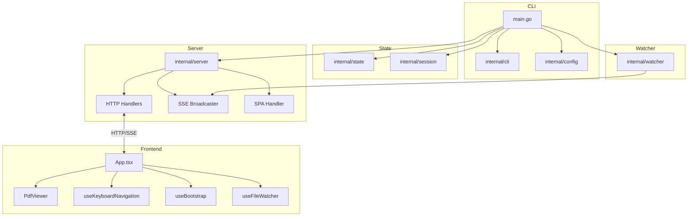
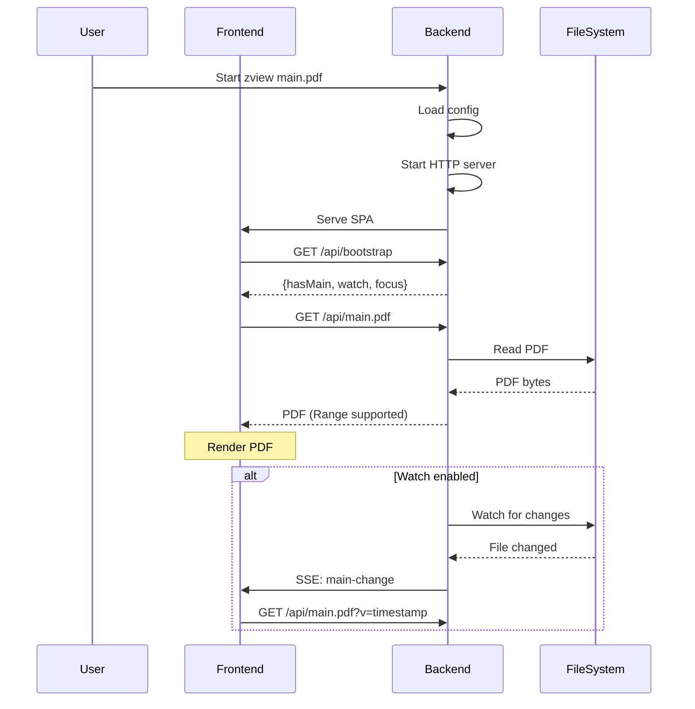

# Architecture

This document describes the architecture of zview.

## System Overview



## Backend Structure

```
backend/
├── main.go                    # Entry point (~80 lines)
└── internal/
    ├── cli/                   # CLI parsing
    │   ├── cli.go             # Options, Parse()
    │   ├── cli_test.go
    │   └── commands.go        # ps, kill subcommands
    ├── config/                # Configuration
    │   ├── config.go          # Config struct, Load()
    │   └── config_test.go
    ├── server/                # HTTP layer
    │   ├── handlers.go        # API handlers
    │   └── sse.go             # SSE broadcaster
    ├── session/               # Session management
    │   └── session.go         # Register/Unregister/List
    ├── state/                 # Application state
    │   ├── state.go           # AppState, SubTab
    │   └── state_test.go
    └── watcher/               # File watching
        └── watcher.go         # Start() with debouncing
```

## Frontend Structure

```
frontend/src/
├── App.tsx                    # Main orchestration
├── components/
│   ├── PdfViewer/             # PDF rendering
│   ├── Pane/                  # Container with header
│   ├── HelpOverlay/           # Keybinding help
│   ├── Menu/                  # Dropdown menu
│   ├── ToastContainer/        # Notifications
│   └── SubTabBar/             # SUB pane tabs
├── hooks/
│   ├── useKeyboardNavigation  # Keyboard handling
│   ├── useBootstrap           # Initial state loading
│   ├── useFileWatcher         # SSE file change watching
│   ├── useContinuousScroll    # Momentum-based scrolling
│   ├── useZoomManager         # Zoom state management
│   └── useTabManager          # SUB tab management
└── lib/
    ├── actionHandlers.ts      # Keyboard action handlers
    ├── config.ts              # Configuration loading
    ├── constants.ts           # Magic numbers
    ├── keyActions.ts          # Keybinding definitions
    ├── keyMatcher.ts          # Key matching utilities
    ├── types.ts               # Shared types
    └── utils.ts               # Utility functions
```

## Password-Protected PDFs

When PDF.js requests a password, the viewer overlays a password prompt in the active pane.
Incorrect entries re-open the prompt. Canceling leaves the current rendering intact.

## Data Flow



## Key Design Decisions

| Decision | Rationale |
|----------|-----------|
| Single binary | Easy distribution, no runtime dependencies |
| Localhost only | Security, no network exposure |
| Embedded frontend | No separate file serving needed |
| Range request support | PDF.js partial loading |
| SSE for file watch | Simple, no websocket overhead |
| Virtualized rendering | Memory efficiency for large PDFs |
| DPR capping | Prevent memory blowups on high-DPI |
